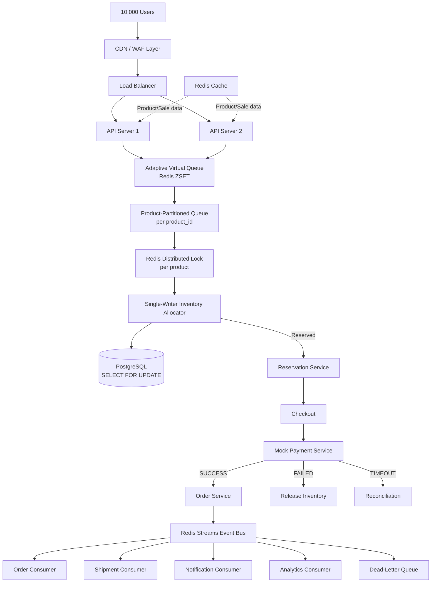
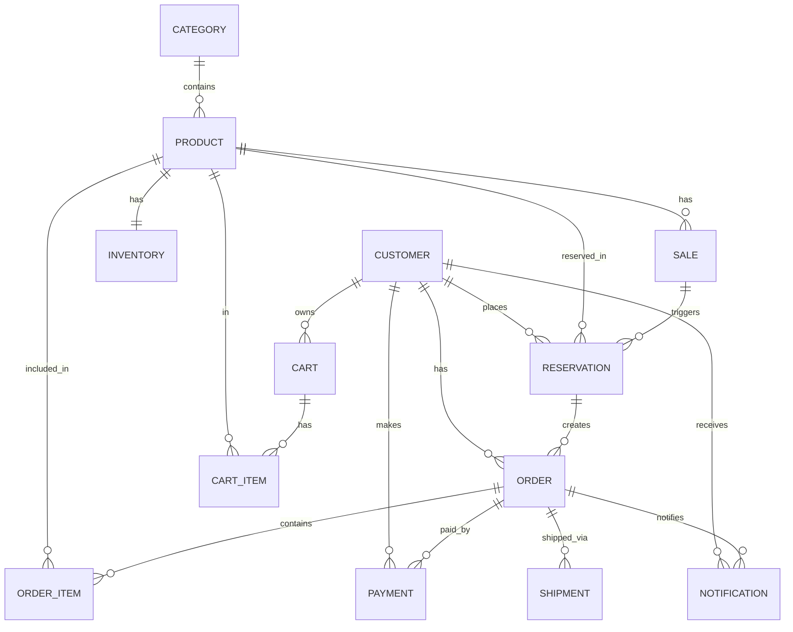

# ⚡ SALESTORM — High-Scale Flash Sale System

> **10,000 users. 100 units. Zero overselling.**

A production-grade flash sale system prototype built for a system design hackathon. The core problem: when 10,000 customers simultaneously click "BUY NOW" for a product with only 100 units, the system must never sell more than 100 units — not even by one.

---

## 1. Project Overview

SALESTORM is a distributed flash sale platform that handles extreme concurrency through a layered architecture: an adaptive virtual queue absorbs the traffic spike, a product-partitioned request queue serializes inventory operations per product, and a single-writer inventory allocator with PostgreSQL row-level locking provides the atomic final guard against overselling.

---

## 2. Problem Statement

Flash sales create a thundering herd problem:

- **10,000** concurrent purchase requests arrive within seconds
- Only **100** units are available
- A naive implementation with a simple `UPDATE inventory SET qty = qty - 1 WHERE qty > 0` under concurrent load will oversell due to race conditions
- The system must handle this without becoming a single-threaded bottleneck for the entire platform

---

## 3. Unique Architecture

Our approach uses **seven architectural principles** working together:

| Principle | Purpose |
|---|---|
| Adaptive Virtual Queue | Absorbs traffic spikes before they hit the database |
| Product-Partitioned Queue | Parallel processing across products, serialized within a product |
| Single-Writer Inventory Allocator | One writer per product at a time (Redis lock + PG row lock) |
| Reservation Token with Expiry | Time-bounded holds prevent inventory deadlock |
| Idempotent Processing | Safe retries at every layer |
| Event-Driven Order Processing | Decoupled, recoverable downstream processing |
| Horizontal Scalability | Stateless API servers scale out freely |

---

## 4. Architecture Diagram



---

## 5. ER Diagram



---

## 6. Component Explanation

### Adaptive Virtual Queue
When users click BUY NOW, requests enter a Redis sorted set (ZSET) keyed by timestamp. A background worker admits batches at a controlled rate. This prevents the database from being overwhelmed by 10,000 simultaneous writes.

### Product-Partitioned Queue
Each product has its own queue partition. Product P001 and P002 process concurrently. Only requests for the **same product** are serialized. This is the "parallel across products, serialized within a product" principle.

### Single-Writer Inventory Allocator
Two-layer protection:
1. **Redis distributed lock** (`SET NX PX`) — serializes at the application layer per product
2. **PostgreSQL `SELECT FOR UPDATE`** — atomic row-level lock as the final guard

Even if Redis fails, PostgreSQL prevents overselling.

### Reservation Service
Creates time-bounded holds on inventory. Short expiry (30s in demo, configurable) ensures inventory is not held indefinitely by users who abandon checkout.

### Mock Payment Service
Simulates SUCCESS, FAILED, and TIMEOUT outcomes. Idempotent via `idempotency_key`. On SUCCESS: confirms inventory (reserved → sold). On FAILED: releases inventory back to available. On TIMEOUT: leaves status UNKNOWN for reconciliation.

### Event Bus (Redis Streams)
All significant state changes publish events. Consumers (Order, Shipment, Notification, Analytics) process events independently. Consumer groups ensure each event is processed exactly once per consumer type. Dead-letter queue handles repeatedly failed messages.

---

## 7. Inventory Concurrency Strategy

```
Thread 1 (P001)          Thread 2 (P001)          Thread 3 (P002)
     |                        |                        |
  Acquire Redis lock P001     |                     Acquire Redis lock P002 ✅
     ✅                    Wait for lock P001...        |
     |                        |                     SELECT FOR UPDATE P002
  SELECT FOR UPDATE P001      |                     available = 10 → 9
  available = 100 → 99        |                     COMMIT
  COMMIT                      |                        |
  Release lock P001           |                     Release lock P002
                         Acquire Redis lock P001 ✅
                         SELECT FOR UPDATE P001
                         available = 99 → 98
                         COMMIT
```

P001 and P002 run **concurrently**. Two requests for P001 are **serialized**.

---

## 8. Queue Strategy

```
10,000 requests → Redis ZSET (score = timestamp)
                       ↓
              Queue Worker (every 100ms)
              admits 50 requests/batch
                       ↓
              Product-specific partition
                       ↓
              Inventory Allocator
```

Queue token response:
```json
{
  "queue_token": "QT-A1B2C3D4",
  "position": 342,
  "status": "WAITING",
  "estimated_wait_seconds": 34.2
}
```

---

## 9. Idempotency Strategy

Every mutating operation accepts an `idempotency_key`:

- **Reservation**: `UNIQUE` constraint on `reservations.idempotency_key`
- **Payment**: `UNIQUE` constraint on `payments.idempotency_key`
- **Order**: `UNIQUE` constraint on `orders.idempotency_key`

If the same key is submitted twice, the existing record is returned. No duplicate processing occurs.

---

## 10. Payment Failure Handling

```
RESERVED → PAYMENT_PENDING → [payment attempt]
                                    ↓
                    SUCCESS: CONFIRMED → inventory reserved→sold
                    FAILED:  RELEASED  → inventory reserved→available
                    TIMEOUT: UNKNOWN   → reconciliation job checks later
```

---

## 11. Order Recovery

If the Order Service is temporarily unavailable after a successful payment:

1. `PaymentSucceeded` event remains in Redis Stream
2. When Order Service recovers, it reads from the stream using consumer groups
3. Order creation is idempotent — replaying the event creates the order exactly once
4. Messages that fail `MAX_RETRY_COUNT` times go to the dead-letter queue

---

## 12. Scalability Strategy

| Component | Scaling approach |
|---|---|
| API Servers | Stateless — add instances behind load balancer |
| Virtual Queue | Redis cluster for queue storage |
| Inventory Allocator | Per-product lock — scales with product catalog |
| Event Consumers | Add consumer instances to consumer groups |
| PostgreSQL | Read replicas for non-critical reads |
| Redis | Cluster mode for high availability |

---

## 13. Security

- All inputs validated via Pydantic schemas
- ORM (SQLAlchemy) prevents SQL injection
- Admin endpoints protected by API key header
- No real payment data stored
- Secrets via environment variables only
- Rate limiting structure in place (extend with Redis rate limiter)
- CORS configured (tighten `allow_origins` in production)

---

## 14. Observability

Every request carries:
- `X-Request-ID` header
- Structured JSON logs with `request_id`, `product_id`, `reservation_id`, `order_id`

Prometheus metrics at `GET /metrics`:

| Metric | Type |
|---|---|
| `http_requests_total` | Counter |
| `http_request_duration_seconds` | Histogram |
| `queue_length` | Gauge |
| `reservation_success_total` | Counter |
| `reservation_failure_total` | Counter |
| `payment_success_total` | Counter |
| `payment_failure_total` | Counter |
| `orders_created_total` | Counter |
| `inventory_available` | Gauge |
| `inventory_reserved` | Gauge |
| `inventory_sold` | Gauge |
| `oversold_units` | Gauge |

---

## 15. API Documentation

Full interactive docs at `http://localhost:8000/docs`

| Method | Endpoint | Description |
|---|---|---|
| GET | `/api/products` | List all active products with sale info |
| GET | `/api/products/{id}` | Get single product |
| POST | `/api/sale/join` | Join virtual queue |
| GET | `/api/sale/queue/{token}` | Poll queue status |
| POST | `/api/reservations` | Create reservation (allocates inventory) |
| GET | `/api/reservations/{id}` | Get reservation |
| DELETE | `/api/reservations/{id}` | Cancel reservation |
| POST | `/api/checkout` | Get checkout summary |
| POST | `/api/payments` | Process mock payment |
| GET | `/api/payments/{id}` | Get payment |
| GET | `/api/orders/{id}` | Get order |
| GET | `/api/admin/dashboard` | Live stats dashboard |
| POST | `/api/admin/simulate` | Demo controls |
| GET | `/metrics` | Prometheus metrics |
| GET | `/health` | Health check |

---

## 16. Local Setup (without Docker)

**Prerequisites:** Python 3.11+, PostgreSQL 15, Redis 7, Node 20

```bash
# Backend
cd backend
python -m venv .venv
source .venv/bin/activate   # Windows: .venv\Scripts\activate
pip install -r requirements.txt
cp ../.env.example ../.env
# Edit .env with your local DB/Redis URLs
python -m app.core.init_db
uvicorn app.main:app --reload --port 8000

# Frontend (separate terminal)
cd frontend
npm install
npm run dev
```

---

## 17. Docker Setup

```bash
# Clone and configure
cp .env.example .env

# Start all services
docker compose up --build

# Services:
# Frontend:   http://localhost:3000
# Backend:    http://localhost:8000
# API Docs:   http://localhost:8000/docs
# Prometheus: http://localhost:9090
# Grafana:    http://localhost:3001  (admin/admin)
# Backend 2:  http://localhost:8001  (simulates second instance)
```

---

## 18. Load Testing Instructions

```bash
# Install Locust
pip install locust

# Run with 100 users
locust -f load-test/locustfile.py --host=http://localhost:8000 \
  --users=100 --spawn-rate=10 --run-time=30s --headless

# Run with 1,000 users
locust -f load-test/locustfile.py --host=http://localhost:8000 \
  --users=1000 --spawn-rate=100 --run-time=60s --headless

# Run with 10,000 users
locust -f load-test/locustfile.py --host=http://localhost:8000 \
  --users=10000 --spawn-rate=500 --run-time=120s --headless

# Web UI (open http://localhost:8089)
locust -f load-test/locustfile.py --host=http://localhost:8000

# Before each test, reset inventory:
curl -X POST http://localhost:8000/api/admin/simulate \
  -H "x-admin-key: admin-demo-key" \
  -H "Content-Type: application/json" \
  -d '{"action": "RESET_INVENTORY"}'
```

---

## 19. Expected 10,000-User Results

| Metric | Expected |
|---|---|
| Total attempts | 10,000 |
| Successful reservations | ≤ 100 |
| Rejected (out of stock) | ≥ 9,900 |
| **Oversold units** | **= 0** |
| Avg latency | < 200ms |
| p95 latency | < 500ms |
| p99 latency | < 1000ms |

The most important assertion:
```python
assert successful_reservations <= initial_inventory  # MUST PASS
assert oversold_units == 0                           # MUST PASS
```

---

## 20. Trade-offs and Limitations

| Trade-off | Decision | Reason |
|---|---|---|
| Redis lock vs. DB-only lock | Both layers | Defense in depth; Redis is faster, PG is the final guard |
| Short reservation expiry (30s) | Configurable | Demo speed; production would use 10-15 minutes |
| Mock payment | No real gateway | Prototype scope; architecture supports real integration |
| SQLite for tests | PostgreSQL in prod | Test speed; `SELECT FOR UPDATE` behavior differs |
| Single Redis instance | Redis Cluster in prod | Prototype simplicity |
| No JWT auth | API key for admin | Prototype scope; structure is in place for JWT |
| Queue admission is async | Slight latency | Necessary to prevent DB overload |

### Known Limitations
- The SQLite test database does not support `SELECT FOR UPDATE` the same way PostgreSQL does. The concurrent tests use threading with SQLite which demonstrates the logic but the true atomic guarantee is only provided by PostgreSQL in the Docker environment.
- The virtual queue admission worker runs in the API process for simplicity; in production it would be a dedicated service.
- Grafana dashboards require manual configuration after first launch.
